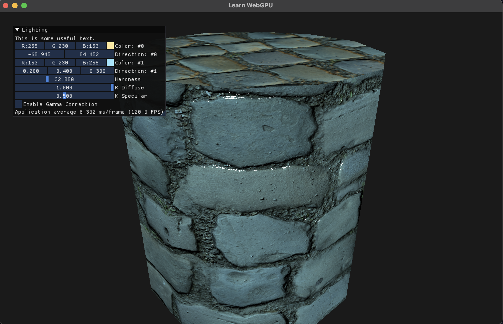

# Learn WebGPU

This is my Zig code to follow along with the WebGPU tutorial series here:

https://eliemichel.github.io/LearnWebGPU/getting-started/first-color.html

## Notable Dependencies

See `build.zig.zon` for specifics, but of note:

- [`zgpu`](https://github.com/zig-gamedev/zgpu): Zig bindings for Dawn WebGPU
- [`zglfw`](https://github.com/zig-gamedev/zglfw): Zig bindings for GLFW, for window and input management
- [`zmath`](https://github.com/zig-gamedev/zmath): Quick maths
- [`obj`](https://github.com/chip2n/zig-obj): For loading `.obj` files
- [`zgui`](https://github.com/zig-gamedev/zgui): ImGui bindings
- [`zpix`](https://github.com/braheezy/zpix): JPEG and PNG decoding
